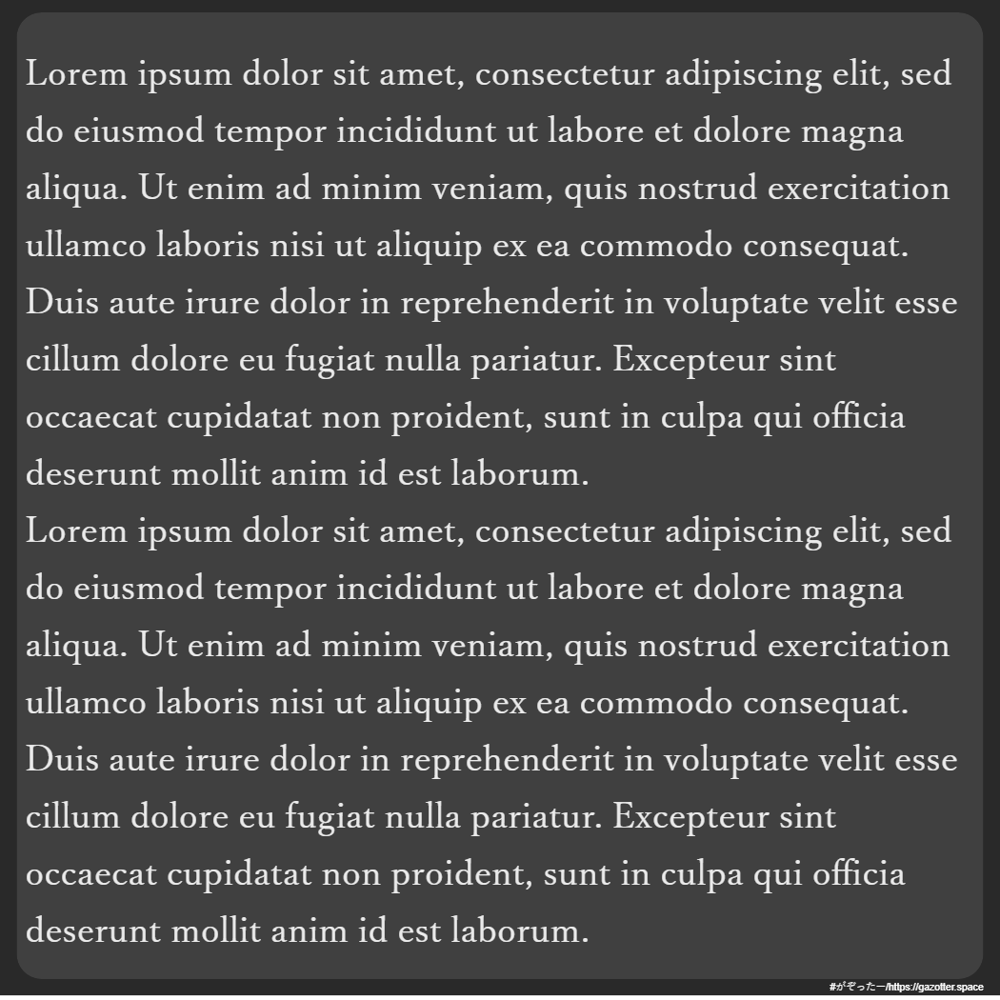

# Gazotter
[日本語](https://github.com/saladbowl77/Gazotter)  
Gazotter generate a photo include writing.  

Users can customize these elements:  

- Backgroud color
- Text alignment
- Font family
- Font color
- Font size

## Language/Library used

- HTML CSS  
- JavaScript  
- [html2canvas](https://html2canvas.hertzen.com)  

## Licenses
This application is licensed under the [MIT License](http://www.opensource.org/licenses/MIT).

## Authors
mede by saladbowl and goahi
