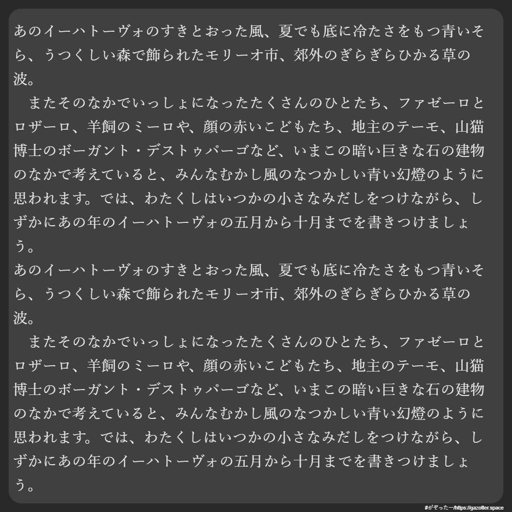

# がぞったー
[English](https://github.com/saladbowl77/Gazotter/blob/master/README-EN.md)  
文字の画像を生成するジェネレーターです。  
背景の色や文字色、フォントなど、以下の要素を変えることができます。  

- 背景の色
- テキストの揃え方
- フォント
- 文字の色
- 文字の大きさ

## 使用言語 プラグイン
- HTML
- CSS  
- JavaScript  
- [html2canvas](https://html2canvas.hertzen.com)  

## ライセンス
がぞったーは[MIT License](http://www.opensource.org/licenses/MIT)の下で利用可能です。

## 作成者
これはさらだぼぉるとごあいによる共同製作です。
